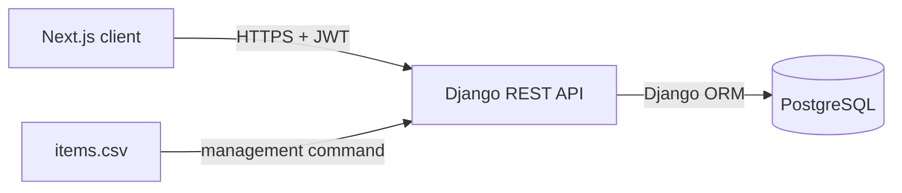
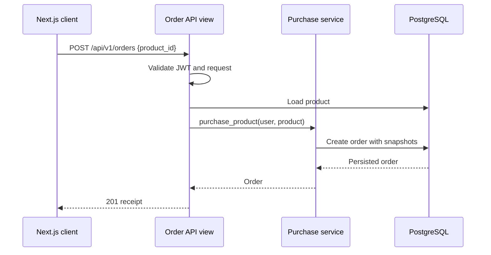

# Architecture

## System Overview

Game Store is a small monorepo with a browser client, a REST API, and PostgreSQL.

## Architecture Goals

The design optimizes for reviewability, explicit business rules, framework
conventions, and reproducible local development. It avoids abstractions that do
not solve a requirement in this small system.

## Module Responsibilities

### Catalog

Owns product persistence, read APIs, location validation, pagination, and the
transactional CSV import command.

### Orders

Owns order persistence, the purchase operation, and receipt representations.
It snapshots commercial product fields at purchase time.

### Authentication

Django owns user/password storage. SimpleJWT issues and validates API tokens.
DRF requires authentication globally and marks only login and documentation as
public.

## Data Model

`Product` uses the CSV identifier as its primary key and constrains price and
location in PostgreSQL. `Order` belongs to a Django user and product while
copying title, price, and location so later product edits cannot rewrite history.

## API Architecture

DRF serializers validate transport input and shape output. Views handle HTTP
concerns and use Django ORM directly. drf-spectacular derives the OpenAPI source
of truth from those serializers and views.

## Authentication Flow

The client exchanges a username and password for JWT access/refresh tokens. The
access token is sent in the Bearer authorization header. A 401 response clears
the local session and returns the user to login.

## Product Listing Flow

The client supplies bounded page, page-size, and optional location parameters.
The API validates filters, orders products deterministically by ID, and returns
DRF page-number metadata.

## Purchase Flow

## CSV Import Flow

The command parses and validates every row before writing, then applies all
upserts in one transaction. A malformed file therefore produces no partial
catalog update. `update_or_create` makes reruns idempotent.

## Error Handling

Serializer and query-parameter validation produce predictable 400 responses;
DRF produces 401 and 404 responses centrally. Unexpected exceptions are not
suppressed by broad handlers.

## Security Considerations

Passwords are hashed by Django, API authorization is deny-by-default, callers
cannot select an order owner, page size is capped, CORS is explicit, and secrets
are read from ignored environment files. The local setup is not presented as a
complete production security posture.

## Frontend Architecture

Next.js App Router owns routes and layouts. A small `lib/api` layer centralizes
base URL, bearer tokens, schema validation, and errors. TanStack Query owns remote
catalog/order state; a lightweight auth provider owns only the browser session.

## Deployment / Local Runtime Architecture

Docker Compose runs PostgreSQL with a health check and persistent volume. Django
and Next.js run directly on the host. This keeps local setup reproducible without
adding application-container complexity that the assessment does not require.
